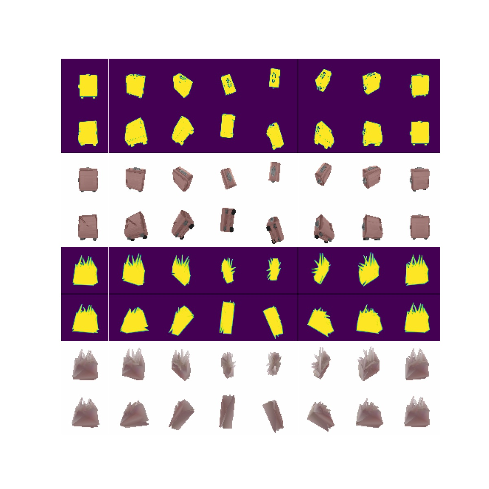

## Abstract

This is a textured 3d model generator VAE model. The following diagram show the simple architecture.  I used Pytorch3d as a differential render and as shown in the figure, inputs and outputs of the model are image so simply, I used L2_loss and KL divergence for training. I used two types images as train data. One represents silhouette of shape and the other represents color of texture.

**Unfortunately, this model can't generate high quality textured 3d mesh, please let me know if you have any good ideas or find my mistakes.**

The following figures are the generated textured 3d model rendering results after 100k times train loops. Top 8x4 images are silhouette and color input multi angel view images, and bottom 8x4 images are generated textured 3d model rendered silhouette and color multi angle view images. It learns shapes well but it doesn't learn textures. Texture patterns and other elements have not been restored. 

The following figure shows the change in loss while training.

* trained  wit plane dataset

* trained with bag dataset

## Setup

* pytorch : 1.9.0+cu102
* pytorch3d : how to setup >> [official site](https://pytorch3d.org/)

You can run it on google colab.

## Download train datasets

I used 3d model dataset from shapenet. You can download datasets from [here](https://shapenet.org/). I used textured 3d model datasets of plane and bag. 

* shapenet: https://shapenet.org/